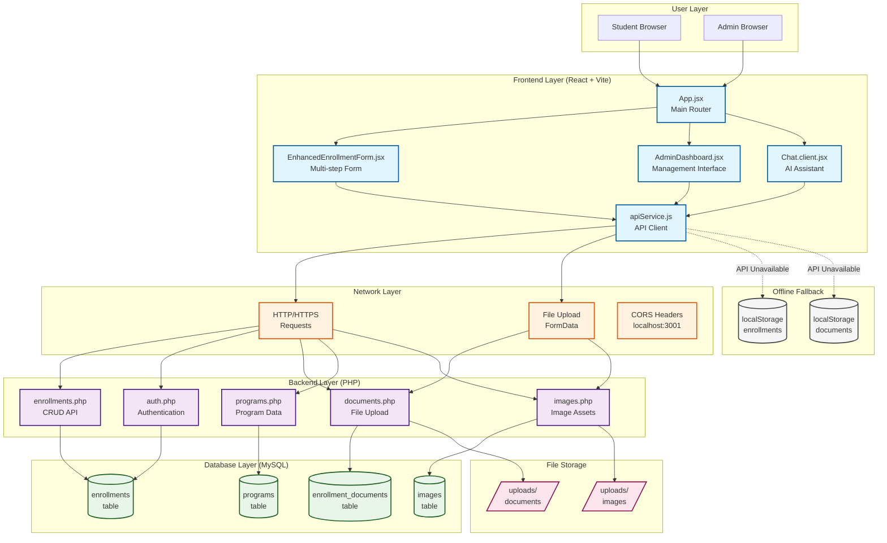
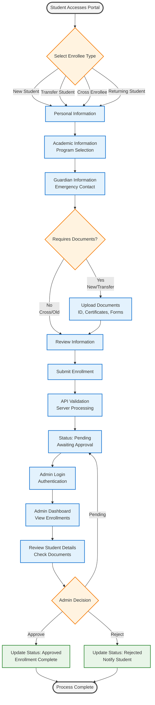

# FEPC Enrollment Portal System Flowchart

## System Architecture & Data Flow

## Enrollment Process Flow

## Process Description

### Student Enrollment Flow
1. **Portal Access**: Student visits the enrollment website (localhost:3001)
2. **Enrollee Type**: Select from New, Transfer, Cross-enrollee, or Returning student
3. **Personal Info**: Name, birth date, gender, contact information, address
4. **Academic Info**: Education level (SHS/College), program/strand, year level, semester
5. **Guardian Info**: Emergency contact name, relationship, phone, address
6. **Document Upload**: Required for new/transfer students (ID photo, certificates, forms)
7. **Review & Submit**: Final verification of all entered information
8. **API Processing**: Server-side validation and database storage
9. **Status Pending**: Initial enrollment status set to "pending"

### Admin Approval Flow
1. **Authentication**: Admin login with username/password (admin/admin123)
2. **Dashboard Access**: View all enrollments with search/filter capabilities
3. **Document Review**: Examine uploaded documents and student information
4. **Decision Making**: Approve, reject, or keep pending based on requirements
5. **Status Update**: Update enrollment status in database via API
6. **Notification**: System reflects status changes to students

## Technical Data Flow

### Frontend → Backend
- **Form Data**: JSON payload with student information
- **File Uploads**: FormData with document files (JPEG/PNG/PDF < 5MB)
- **Authentication**: POST request with credentials
- **Status Updates**: PUT requests with enrollment ID and new status

### Backend → Database
- **Enrollment Creation**: INSERT into enrollments table
- **Document Storage**: File save + INSERT into enrollment_documents table
- **Status Updates**: UPDATE enrollments SET status = ?
- **Data Retrieval**: SELECT with JOINs for complete enrollment records

### Offline Fallback
- **localStorage**: Browser storage for API unavailability
- **Data Persistence**: Enrollments and documents saved locally
- **Sync Capability**: Automatic sync when connection restored

## Key System Components

### Frontend Components
- **App.jsx**: Main application router and state management
- **EnhancedEnrollmentForm.jsx**: Multi-step enrollment wizard
- **AdminDashboard.jsx**: Administrative management interface
- **apiService.js**: Centralized API client with fallback logic

### Backend APIs
- **enrollments.php**: CRUD operations for enrollment records
- **auth.php**: User authentication and session management
- **documents.php**: File upload and document management
- **programs.php**: Academic program data retrieval
- **images.php**: Logo and image asset management

### Database Tables
- **enrollments**: Student enrollment data and status
- **programs**: Available academic programs and requirements
- **enrollment_documents**: Uploaded document tracking
- **images**: Image assets and metadata

## Error Handling & Validation

### Client-Side Validation
- **Real-time Feedback**: Form validation with error messages
- **File Validation**: Type, size, and format checking
- **Required Fields**: Mandatory field enforcement
- **Data Format**: Email, phone, date validation

### Server-Side Validation
- **Data Sanitization**: Input cleaning and validation
- **Duplicate Prevention**: Email uniqueness checking
- **File Security**: Upload restrictions and virus scanning
- **Business Rules**: Academic requirement validation

### Error Recovery
- **API Fallback**: localStorage for offline operation
- **Graceful Degradation**: Continued functionality without full features
- **User Feedback**: Clear error messages and recovery instructions

---
*This comprehensive flowchart shows both the system architecture and enrollment workflow for the FEPC Enrollment Portal, providing a complete technical and process overview.*
