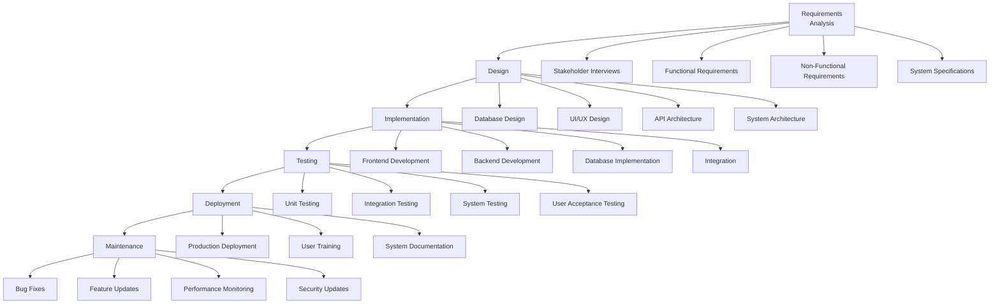

# FEPC Enrollment Portal Development: Waterfall Model

## Software Development Life Cycle (SDLC) Phases

## Detailed Phase Breakdown

### 1. Requirements Analysis Phase
**Duration**: 2 weeks
**Activities**:
- Conducted stakeholder interviews with FEPC administrators and faculty
- Gathered requirements for student enrollment, document management, and admin approval
- Analyzed existing manual enrollment processes
- Defined user roles: Students, Administrators, and System Administrators

**Deliverables**:
- Functional Requirements Document (FRD)
- Non-Functional Requirements Document (NFRD)
- Use Case Diagrams
- User Stories and Acceptance Criteria
- System Requirements Specification (SRS)

### 2. Design Phase
**Duration**: 3 weeks
**Activities**:
- Designed database schema with normalized tables
- Created UI/UX wireframes and mockups
- Planned API endpoints and data flow
- Designed security measures and access controls

**Deliverables**:
- Database Schema Design (ER Diagrams)
- UI/UX Design Mockups
- API Design Documentation
- System Architecture Diagrams
- Security Design Document

### 3. Implementation Phase
**Duration**: 8 weeks
**Activities**:
- Developed React frontend with multi-step enrollment form
- Built PHP backend API with MySQL database
- Implemented file upload system for documents
- Created admin dashboard with filtering and approval features
- Integrated authentication and authorization

**Deliverables**:
- Complete source code (Frontend + Backend)
- Database setup scripts
- API documentation
- User manual draft
- Code documentation and comments

### 4. Testing Phase
**Duration**: 4 weeks
**Activities**:
- Conducted unit testing for individual components
- Performed integration testing for API endpoints
- Executed system testing for end-to-end workflows
- Carried out user acceptance testing with sample users

**Deliverables**:
- Test Cases and Test Results
- Bug Reports and Resolution Logs
- Performance Test Results
- User Acceptance Test Report
- Quality Assurance Certificate

### 5. Deployment Phase
**Duration**: 2 weeks
**Activities**:
- Set up production server environment
- Configured database and file storage
- Deployed application to production
- Conducted final system verification
- Provided user training sessions

**Deliverables**:
- Production Deployment Guide
- System Configuration Document
- User Training Materials
- Deployment Checklist
- Go-Live Report

### 6. Maintenance Phase
**Duration**: Ongoing
**Activities**:
- Monitor system performance and uptime
- Address bug reports and user feedback
- Implement security updates and patches
- Add new features based on user requirements
- Perform regular database maintenance

**Deliverables**:
- Maintenance Logs
- Update Release Notes
- Performance Reports
- Security Audit Reports
- Feature Enhancement Documentation

## Project Timeline Summary

| Phase | Duration | Start Date | End Date | Key Milestones |
|-------|----------|------------|----------|----------------|
| Requirements | 2 weeks | Week 1 | Week 2 | SRS Approved |
| Design | 3 weeks | Week 3 | Week 5 | Design Documents Complete |
| Implementation | 8 weeks | Week 6 | Week 13 | MVP Ready |
| Testing | 4 weeks | Week 14 | Week 17 | UAT Passed |
| Deployment | 2 weeks | Week 18 | Week 19 | System Live |
| Maintenance | Ongoing | Week 20 | - | Continuous Support |

## Risk Management
- **Technical Risks**: Mitigated through code reviews and testing
- **Schedule Risks**: Managed with milestone tracking and buffer time
- **Resource Risks**: Addressed through team coordination and backup planning
- **Scope Risks**: Controlled via change management process

## Quality Assurance
- Code quality maintained through peer reviews
- Automated testing implemented for critical functions
- Security testing conducted throughout development
- Performance benchmarks established and monitored

---
*This waterfall model documentation outlines the systematic approach used in developing the FEPC Enrollment Portal, ensuring comprehensive coverage of all SDLC phases with specific deliverables and timelines.*
